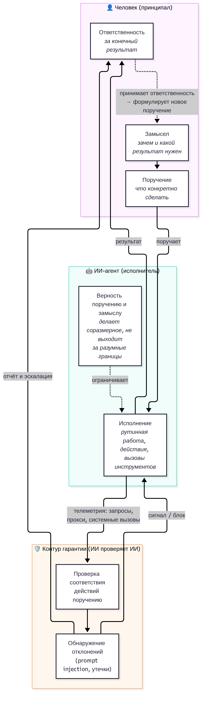
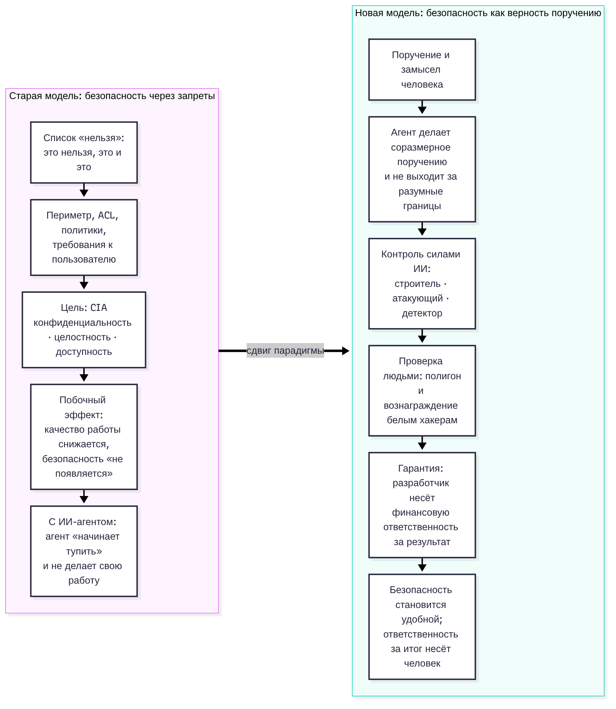
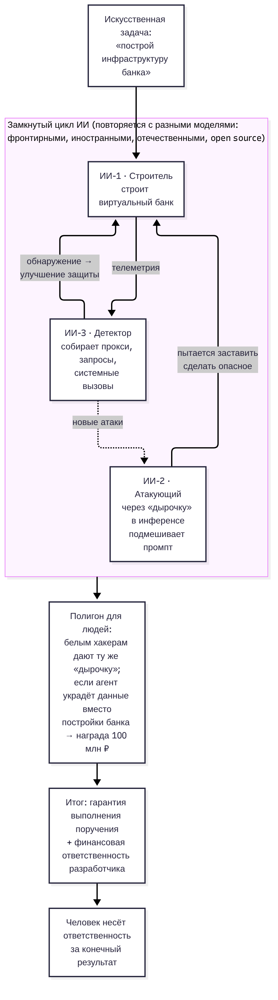
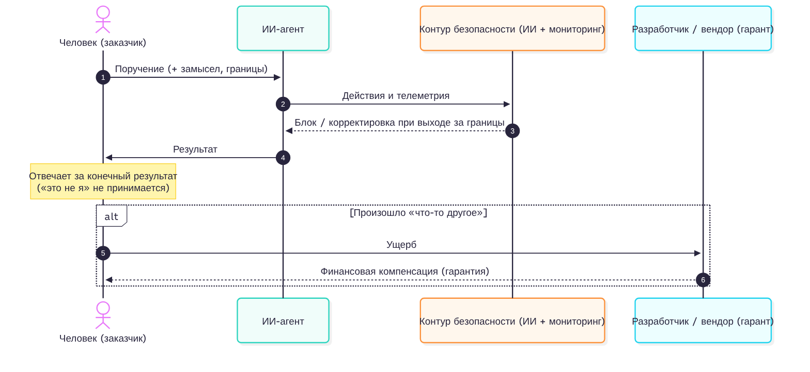

# ai-security-fidelity-yury-1300

Разбор тезиса Юрия Максимова о новой природе безопасности в эпоху ИИ-агентов: расшифровка, анализ, схемы, объяснение простыми словами, план действий и конспект презентации.

> «С приходом ИИ обновляется природа безопасности: появляется гарантия верности машины поручению и замыслу человека, который, в свою очередь, принимает ответственность за результат ее деятельности.»
> — подпись к посту [t.me/yury/1300](https://t.me/yury/1300), канал «Максимов | ЗАПИСКИ», 7 октября 2026

## Источник
- **Пост:** https://t.me/yury/1300 (видео 3:11).
- **Полная запись:** пленарная сессия форума «Цифровые решения» «Государство как цифровой сервис: где остановиться?», 7.10.2026, НЦ «Россия», Москва. VK Video: https://vkvideo.ru/video-160329499_456285376. Ответ Ю. Максимова идёт на **57:07–61:51**.
- Telegram не отдаёт видео поста через веб («Media is too big»), поэтому расшифрована полная запись. Совпадение проверено по кадру (превью поста = кадр записи) и по тексту: тезис подписи звучит на 61:02–61:31. Вероятно, клип в посте соответствует 58:37–61:51 записи. Это оценка, а не точная сверка с файлом из Telegram.
- Видео и аудио в репозиторий не включены (размер и права на запись трансляции), см. `.gitignore`.

## Структура
| Путь | Что внутри |
|---|---|
| [`transcript/transcript.md`](transcript/transcript.md) | Чистовая расшифровка с абзацами, таблица сомнительных мест |
| [`transcript/transcript_timestamps.md`](transcript/transcript_timestamps.md) | Сырая расшифровка с таймкодами (фрагмент + полная запись) |
| [`transcript/transcript.srt`](transcript/transcript.srt) | Субтитры для фрагмента 56:55–62:05 |
| [`transcript/raw_whisper_large-v3.json`](transcript/raw_whisper_large-v3.json) | Сырой вывод faster-whisper с пословными таймкодами и уверенностью |
| [`analysis.md`](analysis.md) | Анализ утверждения: тезис, понятия, предпосылки, сильные и слабые стороны, связь с AI alignment, принципал–агент, HITL, подотчётностью, CIA; следствия для ИБ |
| [`simple.md`](simple.md) | Объяснение простыми словами с бытовым примером |
| [`action_plan.md`](action_plan.md) | План внедрения для ИБ или компании с ИИ-агентами: фазы, сроки, критерии готовности |
| [`presentation_outline.md`](presentation_outline.md) | Конспект презентации на 12 слайдов |
| [`diagrams/*.mmd`](diagrams/) | Исходники схем Mermaid |
| [`diagrams/rendered/`](diagrams/rendered/) | Отрендеренные PNG и SVG |
| [`scripts/`](scripts/) | Рендер схем, загрузка медиа, расшифровка, генерация таймкодов |

## Схемы
| Схема | Файл |
|---|---|
| Человек (замысел, поручение, ответственность) ↔ ИИ (исполнение, верность) |  |
| Старая модель безопасности против новой |  |
| Цикл «ИИ проверяет ИИ» + полигон |  |
| Цепочка ответственности |  |

## Как перерендерить схемы
```bash
npm i -g @mermaid-js/mermaid-cli     # даёт команду mmdc
./scripts/render.sh                  # diagrams/*.mmd → diagrams/rendered/*.png|svg
```
`scripts/puppeteer.json` передаёт Chromium флаг `--no-sandbox`, это нужно в контейнерах. Без локальной установки можно использовать https://mermaid.live или kroki.io.

## Как воспроизвести расшифровку
```bash
pip install faster-whisper            # плюс yt-dlp и ffmpeg
./scripts/get_media_and_transcribe.sh # скачает запись в media/, вырежет фрагмент, расшифрует large-v3
```

## Оговорки
- Расшифровка машинная (Whisper large-v3) с ручной вычиткой. Сомнительные места помечены в тексте и вынесены в таблицу в `transcript.md`.
- Анализ, план и упрощённое объяснение отражают интерпретацию автора репозитория, а не позицию спикера. Цитаты взяты только из расшифровки.
